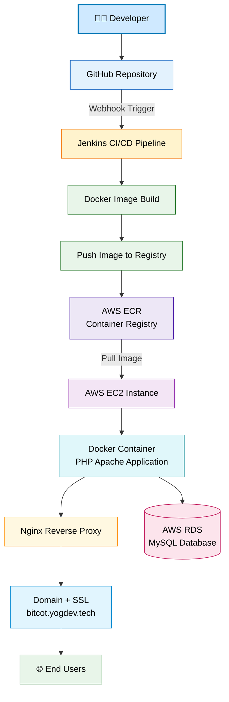

# 🚀 Bitcot DevOps CI/CD Project

## 📌 Project Overview

This project demonstrates a complete **DevOps CI/CD pipeline** for deploying a containerized web application using **GitHub, Jenkins, Docker, AWS ECR, AWS EC2, AWS RDS, Nginx, and a custom domain with SSL**.

The pipeline automatically builds, pushes, and deploys the application whenever code is pushed to the GitHub repository.

---

# 🏗️ Architecture Diagram



---

# ⚙️ Tech Stack

| Technology    | Purpose                |
| ------------- | ---------------------- |
| GitHub        | Source code repository |
| Jenkins       | CI/CD automation       |
| Docker        | Containerization       |
| AWS EC2       | Application hosting    |
| AWS ECR       | Docker image registry  |
| AWS RDS       | Managed MySQL database |
| Nginx         | Reverse proxy          |
| Let's Encrypt | SSL certificate        |

---

# 🔄 CI/CD Pipeline Workflow

The CI/CD pipeline works as follows:

1. Developer pushes code to **GitHub**
2. GitHub triggers **Jenkins Pipeline**
3. Jenkins performs the following stages:

```
Checkout Code
Build Docker Image
Tag Docker Image
Push Image to AWS ECR
Deploy Container on EC2
```

4. EC2 pulls the latest image from **AWS ECR**
5. Docker container runs the application
6. **Nginx reverse proxy** exposes the application through the domain
7. Users access the application via **HTTPS**

---

# 🐳 Dockerfile

```dockerfile
FROM php:8.2-apache

RUN docker-php-ext-install mysqli

COPY app/ /var/www/html/

EXPOSE 80
```

---

# ⚙️ Jenkins Pipeline

```groovy
pipeline {
    agent any

    environment {
        AWS_REGION = 'us-east-1'
        ECR_REPO = '201186892936.dkr.ecr.us-east-1.amazonaws.com/bitcot-devops-app'
        IMAGE_TAG = "${BUILD_NUMBER}"
    }

    stages {

        stage('Checkout') {
            steps {
                git branch: 'main',
                url: 'https://github.com/YR55/bitcot-devops-app.git'
            }
        }

        stage('Build Docker Image') {
            steps {
                sh 'docker build -t bitcot-app:${IMAGE_TAG} .'
            }
        }

        stage('Tag Image') {
            steps {
                sh '''
                docker tag bitcot-app:${IMAGE_TAG} $ECR_REPO:${IMAGE_TAG}
                docker tag bitcot-app:${IMAGE_TAG} $ECR_REPO:latest
                '''
            }
        }

        stage('Login to ECR') {
            steps {
                withCredentials([[$class: 'AmazonWebServicesCredentialsBinding', credentialsId: 'aws-creds']]) {
                    sh '''
                    aws ecr get-login-password --region $AWS_REGION | \
                    docker login --username AWS --password-stdin 201186892936.dkr.ecr.us-east-1.amazonaws.com
                    '''
                }
            }
        }

        stage('Push Image') {
            steps {
                sh '''
                docker push $ECR_REPO:${IMAGE_TAG}
                docker push $ECR_REPO:latest
                '''
            }
        }

        stage('Deploy') {
            steps {
                sh '''
                docker pull $ECR_REPO:latest

                docker stop bitcot-php || true
                docker rm bitcot-php || true

                docker run -d \
                --name bitcot-php \
                -p 8081:80 \
                --restart always \
                $ECR_REPO:latest
                '''
            }
        }
    }
}
```

---

# 🌐 Application URL

```
https://bitcot.yogdev.tech
```

---

# 🗄️ Database

The application uses **AWS RDS MySQL** as the backend database to store user information such as:

* Name
* Email
* Timestamp

---

# 📦 Deployment Infrastructure

The project infrastructure includes:

* GitHub repository for source code
* Jenkins CI/CD server
* Docker containerized application
* AWS ECR for storing images
* AWS EC2 instance for running containers
* AWS RDS for database management
* Nginx reverse proxy for domain routing
* SSL certificate for secure access

---

# 🎯 Key Features

✔ Automated CI/CD pipeline
✔ Docker containerization
✔ AWS ECR image registry
✔ AWS EC2 deployment
✔ AWS RDS database integration
✔ Domain + SSL secure access
✔ Automatic deployment on GitHub push

---

# 👨‍💻 Author

**Yogesh Verma**

DevOps Engineer
(B.Tech : Computer Science & Engineering)

---

# ⭐ Conclusion

This project demonstrates a **real-world DevOps CI/CD pipeline implementation** using modern cloud-native tools and AWS infrastructure.
The pipeline ensures automated, reliable, and secure deployment of containerized applications.

---
